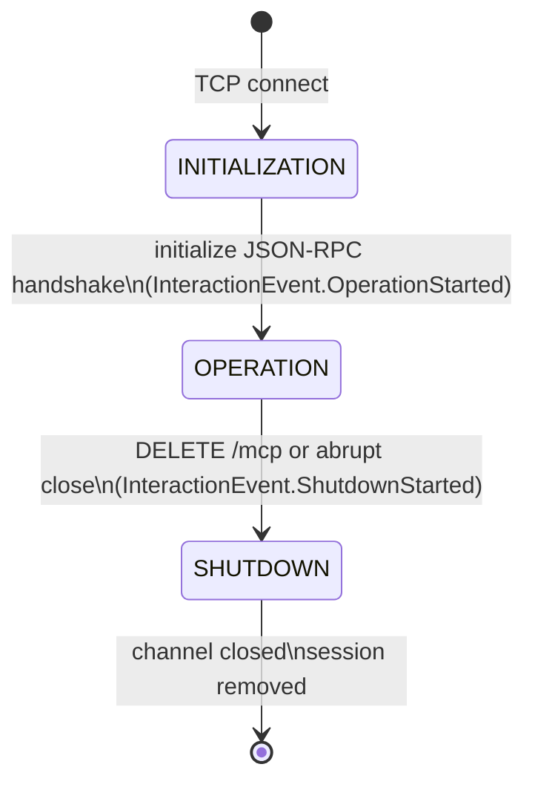
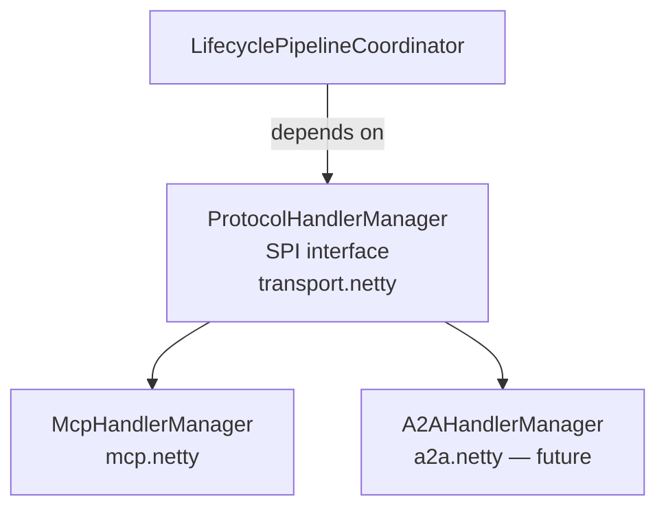

# Tachyon Architecture

## Layers

Three layers with strict one-way dependencies. No upward imports.

```
┌─────────────────────────────────┐
│  Protocol  (me.kpavlov.tachyon.mcp.*)          │  MCP codecs, handlers, dispatch
├─────────────────────────────────┤
│  Transport (me.kpavlov.tachyon.transport.netty) │  Netty pipeline, SSE, HTTP
├─────────────────────────────────┤
│  Runtime   (me.kpavlov.tachyon.runtime)         │  Server, Session, InteractionEvent
└─────────────────────────────────┘
```

Runtime has no Netty or MCP imports. Transport has no MCP imports.

---

## Package Map

```
me.kpavlov.tachyon.runtime          ← Server, Session, InteractionContext, InteractionEvent
me.kpavlov.tachyon.transport.netty  ← InteractionHandler, LifecyclePipelineCoordinator,
│                                      ProtocolHandlerManager (SPI), NettyServer
└── .http                           ← Origin/Endpoint/Accept/Stateless validators
└── .sse                            ← SseManager, PostSseStream, NettySseConnection, SseDecoder

me.kpavlov.tachyon.mcp              ← TachyonServer (entry point)
me.kpavlov.tachyon.mcp.protocol     ← McpMessage, codecs (~160), models (~180)
me.kpavlov.tachyon.mcp.dispatch     ← JsonRpcDispatcher
me.kpavlov.tachyon.mcp.netty        ← McpChannelInitializer, McpHandlerManager,
│                                      McpInitializationHandler, McpOperationHandler
└── (implements ProtocolHandlerManager SPI)
me.kpavlov.tachyon.mcp.server       ← features (tools, prompts, resources), handlers, session
```

---

## Connection Lifecycle



---

## Netty Pipeline

```mermaid
flowchart LR
    subgraph transport.netty
        IH[InteractionHandler\n@Sharable]
        LC[LifecyclePipelineCoordinator]
    end
    subgraph transport.netty.http
        V[Validators\nOrigin · Endpoint · Accept]
    end
    subgraph mcp.netty [mcp.netty — current phase handler]
        INIT[McpInitializationHandler]
        OP[McpOperationHandler]
    end

    TCP -->|new channel| V --> IH --> AGG[HttpObjectAggregator] --> INIT
    INIT -->|OperationStarted| LC -->|pipeline.replace| OP
    OP -->|ShutdownStarted| LC -->|ctx.close| TCP
```

`LifecyclePipelineCoordinator` only knows the `ProtocolHandlerManager` SPI — no MCP imports.

---

## Adding a Second Protocol

Implement `ProtocolHandlerManager` and provide a `ChannelInitializer`. No changes to transport layer required.


