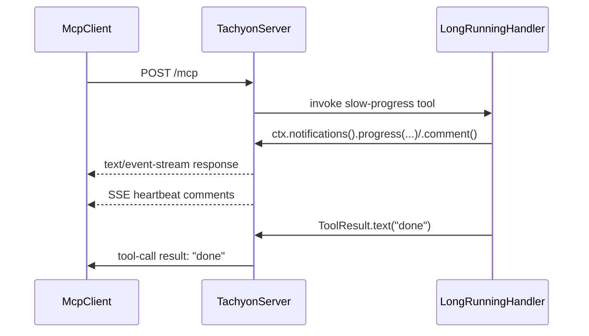

# Configuration — Tachyon MCP Server

All configuration flows through `TachyonServer.builder()` (Java) or the `TachyonServer { }` DSL (Kotlin). Four scopes: `info`, `capabilities`, `network`, `session`.

```java
TachyonServer.builder()
    .info(i -> i.name("my-server").version("1.0"))
    .network(n -> n.port(8080).ioEngine(NettyIoEngine.AUTO))
    .session(s -> s.sessionTtl(Duration.ofMinutes(5)))
    .start();
```

```kotlin
TachyonServer {
    info { name = "my-server"; version = "1.0" }
    network { port = 8080 }
    session { sessionTtl = 5.minutes }
}.start()
```

## Network

Configured via `network { }` / `NetworkConfig.Builder`.

| Option | Default | Description |
|---|---|---|
| `host` | `127.0.0.1` | Bind address |
| `port` | — | Listen port; `0` picks a free port. Must be set before `start()` |
| `address` | — | Full `SocketAddress`; mutually exclusive with `host`/`port` |
| `endpointPath` | `/mcp` | HTTP endpoint path |
| `readerIdleTimeout` | `60s` | Close connections with no inbound traffic for this long |
| `writerIdleTimeout` | `5m` | Close connections with no outbound traffic for this long |
| `heartbeatInterval` | `15s` | SSE heartbeat interval for silent listening streams; `<= 0` disables |
| `maxContentLength` | `1 MB` | Max aggregated HTTP request body |
| `ioEngine` | `AUTO` | Netty I/O transport, see below |

`.port(int)` is also available as a top-level `ServerBuilder` shortcut.

### Keep-alive for long-running tools



`readerIdleTimeout` closes any connection that receives **no inbound bytes** for its duration.
After a client finishes sending a request it stays silent while waiting for the reply, so this
timer also runs while your handler is computing — a tool that takes longer than
`readerIdleTimeout` (default `60s`) to respond has its connection reaped before it can answer.

> [!NOTE]
> 💡 Set `readerIdleTimeout` to `Duration.ZERO` to disable closing connections on idle inbound stream.

The fix is not a bigger timeout — it is to keep the stream alive with **SSE + heartbeats**. Any
server→client message on the POST upgrades the response from buffered JSON to `text/event-stream`;
from then on the connection is a live SSE stream, `readerIdleTimeout` is a **no-op** on it, and a
fixed-rate scheduler emits a `:\r\n` comment every `heartbeatInterval` (default `15s`) so the
stream never looks idle. There are two ways to trigger the upgrade:

- **`progress(token, ...)`** — when the client requested progress (sent `_meta.progressToken`).
  Forward that token, exposed as `ToolRequest.progressToken()`. A `null` token **throws**, so use
  this path only when a token is present.
- **`comment(msg)`** — a token-free SSE comment (`: msg`). Use it to keep alive when no progress
  token is available. `comment()` emits a bare `:` heartbeat.

Both are reachable only from the request-level `ToolHandler` (the `SyncToolHandler`/`ToolArgs`
convenience overload carries neither the token nor a stream handle):

```java
class SlowTool implements ToolHandler {
    public ToolDescriptor descriptor() {
        return ToolDescriptor.builder().name("slow-task").description("Long task, kept alive").build();
    }

    public ToolResult handle(InteractionContext ctx, ToolRequest request) throws Exception {
        var token = request.progressToken();          // client _meta.progressToken; null if absent
        for (int i = 0; i < total; i++) {
            // First call upgrades POST → SSE and arms the heartbeat.
            if (token != null) {
                ctx.notifications().progress(token, i, total, "step " + i);
            } else {
                ctx.notifications().comment("step " + i);   // token-free keep-alive
            }
            doSlowStep(i);
        }
        return ToolResult.text("done");
    }
}
```

Guidance:

- No token available? Use `comment(...)` — it upgrades and keeps the stream alive without one.
  `progress(...)` requires a non-null token and throws otherwise.
- Keep `heartbeatInterval < readerIdleTimeout` (default `15s < 60s`) so a live stream's own
  heartbeats always beat the reader-idle deadline.
- Size `readerIdleTimeout` for **dead-peer detection** (how long a silent connection may live),
  not for how long a tool runs. Bumping it to cover a slow tool is the wrong lever — use the SSE
  keep-alive pattern above.
- `heartbeatInterval <= 0` disables heartbeats; silent SSE streams then close on idle. Lower it
  below any proxy/load-balancer idle timeout sitting in front of the server.

### CORS

| Option | Default | Description |
|---|---|---|
| `allowedOrigins` | — | Allowed `Origin` values; unset disables CORS handling |
| `allowNullOrigin` | `false` | Allow `Origin: null` |
| `allowPrivateNetworks` | `false` | Allow private-network CORS preflight |
| `allowedHeaders` | — | Extra allowed request headers |

## I/O engine

`NettyIoEngine` selects the Netty transport:

| Engine | OS | Runtime dependency |
|---|---|---|
| `AUTO` (default) | any | picks best available, in order below |
| `IO_URING` | Linux 5.9+ | `netty-transport-native-io_uring` |
| `EPOLL` | Linux | `netty-transport-native-epoll` |
| `KQUEUE` | macOS / BSD | `netty-transport-native-kqueue` |
| `NIO` | any | none (bundled) |

`AUTO` detection order: io_uring → epoll → kqueue → NIO. Detection happens once and is cached; the chosen engine is logged at startup:

```text
Netty I/O engine: KQUEUE
```

Native transports are optional runtime dependencies — `tachyon-server` itself depends only on the portable NIO transport. To enable a native transport, add the matching jar with your platform classifier (via [os-maven-plugin](https://github.com/trustin/os-maven-plugin)):

```xml
<build>
    <extensions>
        <extension>
            <groupId>kr.motd.maven</groupId>
            <artifactId>os-maven-plugin</artifactId>
            <version>1.7.1</version>
        </extension>
    </extensions>
</build>

<profiles>
    <profile>
        <id>netty-native-linux</id>
        <activation>
            <os><name>linux</name></os>
        </activation>
        <dependencies>
            <dependency>
                <groupId>io.netty</groupId>
                <artifactId>netty-transport-native-epoll</artifactId>
                <version>${netty.version}</version>
                <classifier>${os.detected.classifier}</classifier>
                <scope>runtime</scope>
            </dependency>
        </dependencies>
    </profile>
    <profile>
        <id>netty-native-mac</id>
        <activation>
            <os><family>mac</family></os>
        </activation>
        <dependencies>
            <dependency>
                <groupId>io.netty</groupId>
                <artifactId>netty-transport-native-kqueue</artifactId>
                <version>${netty.version}</version>
                <classifier>${os.detected.classifier}</classifier>
                <scope>runtime</scope>
            </dependency>
        </dependencies>
    </profile>
</profiles>
```

See [examples/weather/pom.xml](../examples/weather/pom.xml) for a complete working setup.

Requesting an explicit engine whose transport is not on the classpath (or not supported by the OS) throws `UnsupportedOperationException` at startup, with Netty's unavailability cause in the message:

```java
network(n -> n.ioEngine(NettyIoEngine.EPOLL)) // fails fast on macOS
```

```kotlin
network { ioEngine = NettyIoEngine.EPOLL }
```

## Session

Configured via `session { }` / `SessionConfig.Builder`. Sessions are off by default
(stateless server). All other session options require `enabled = true` — configuring
them on a stateless server fails at construction.

| Option | Default | Description |
|---|---|---|
| `enabled` | `false` | Server-side sessions are off by default (stateless). Set `true` to create sessions with TTL tracking |
| `sessionTtl` | `30s` | Idle sessions are evicted after this duration |
| `janitorInterval` | `5s` | Janitor sweep interval; controls how often expired sessions are checked |
| `sessionLogRouter` | in-memory | Custom event log router |
| `sessionStore` | in-memory | Custom session store |
| `sessionIdGenerator` | `sess_<uuid>` | Custom hook for deriving session ids from the initialize `HttpRequest` (headers/URI) |

## Runtime

Configured via `runtime { }` / `RuntimeConfig.Builder`.

| Option | Default | Description |
|---|---|---|
| `shutdownGracePeriod` | `5s` | Time in-flight handlers get to drain on `close()`; `ZERO` interrupts immediately |

## Identity and capabilities

`info { }` sets the `serverInfo` returned by `initialize` (name, version, title, etc.); `.name(String)` is a top-level shortcut. `capabilities { }` toggles advertised MCP capabilities. See [quickstart](quickstart.md) for a full example.

## Advanced

| Option | Description |
|---|---|
| `executor(ExecutorService)` | Handler executor; default runs handlers on virtual threads |
| `threadFactory(ThreadFactory)` | Thread factory for the default executor |
| `pipelineCustomizer(Consumer<ChannelPipeline>)` | Hook to mutate the Netty pipeline after MCP handlers are installed |
| `jsonSchemaValidator(...)` | Custom JSON Schema validator for tool inputs |
