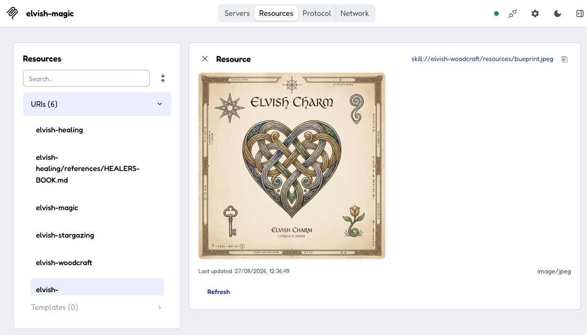

# MCP Skills Example


Serves four fictional Agent Skills with Tachyon's `SkillsExtension`, combined from two sources: `elvish-magic` and `elvish-healing` are bundled on the classpath
(`src/main/resources/skills`) via `ClasspathSkillsRegistry`, while `elvish-stargazing` and
`elvish-woodcraft` are served straight from the filesystem (`src/data/skills`) via
`FilesystemSkillsRegistry`. Both are registered with `SkillsExtension.Builder#registry(...)`, which
composes multiple registries internally. The healing and woodcraft skills each include a supporting
resource (a healer's book and a carving blueprint). Clients can fetch their `skill://` resources
through the base `resources/read` method without extension negotiation.
Clients negotiate `io.modelcontextprotocol/skills` to use `skills/list`, `skills/get`, and
`resources/directory/read`.



## Quickstart

The skills extension is currently built from this repository's SNAPSHOT:

```shell
# From the repository root
./mvnw install -pl tachyon-extensions,tachyon-testkit -am -DskipTests -Djacoco.skip=true
```

Running example
```shell
cd examples/mcp-skills
mvn package
java -jar target/mcp-skills-example.jar
```

Connect an MCP 2026-07-28 client to `http://localhost:8080/mcp` and declare the
`io.modelcontextprotocol/skills` extension.

The included `.mcp.json` registers that endpoint as `elvish-magic-skill-mcp` for clients that load project MCP configuration.

## Resources

Every skill file is also exposed as a plain MCP resource, so a client that hasn't negotiated the
skills extension can still discover them with the base `resources/list` method.

<details>
<summary>Json Response</summary>

```json
{
    "jsonrpc": "2.0",
    "id": 2,
    "result": {
        "resources": [
            {
                "uri": "skill://elvish-healing/SKILL.md",
                "description": "Create gentle, fictional Elvish remedies for fantasy stories and games",
                "mimeType": "text/markdown",
                "name": "elvish-healing"
            },
            {
                "uri": "skill://elvish-healing/references/HEALERS-BOOK.md",
                "mimeType": "text/markdown",
                "name": "elvish-healing/references/HEALERS-BOOK.md"
            },
            {
                "uri": "skill://elvish-magic/SKILL.md",
                "description": "Compose gentle, fictional Elvish spells for light, water, and growing things",
                "mimeType": "text/markdown",
                "name": "elvish-magic"
            },
            {
                "uri": "skill://elvish-stargazing/SKILL.md",
                "description": "Read fictional Elvish star patterns for gentle guidance and omens",
                "mimeType": "text/markdown",
                "name": "elvish-stargazing"
            },
            {
                "uri": "skill://elvish-woodcraft/SKILL.md",
                "description": "Carve fictional Elvish charms and trinkets from storywood",
                "mimeType": "text/markdown",
                "name": "elvish-woodcraft"
            },
            {
                "uri": "skill://elvish-woodcraft/resources/bueprint.jpeg",
                "mimeType": "image/jpeg",
                "name": "elvish-woodcraft/resources/bueprint.jpeg"
            }
        ],
        "resultType": "complete",
        "ttlMs": 0,
        "cacheScope": "public"
    }
}
```

</details>
